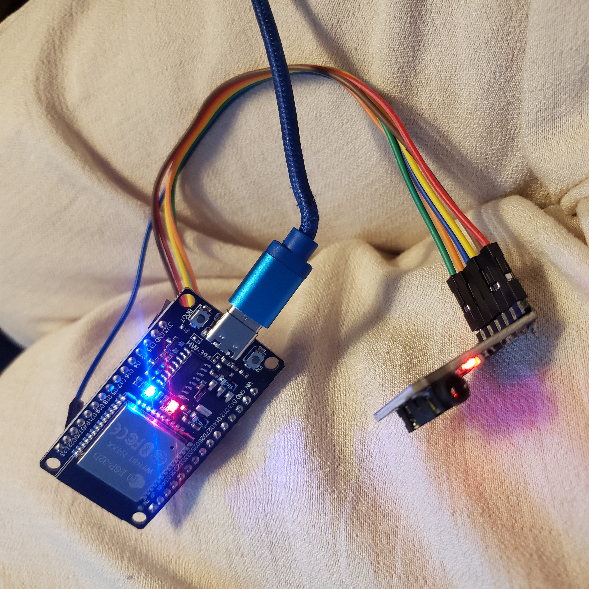

# ESP32 Bluetooth Stereo Adapter

Turn a vintage stereo into a modern Bluetooth audio receiver using an ESP32 and a PCM5102A I²S DAC.

This project receives Bluetooth audio from a phone, tablet, or computer and outputs high-quality analog stereo audio to any amplifier or stereo with RCA or AUX inputs. 
An onboard LED indicates when a Bluetooth device is connected.

---

# Features

- 📱 Bluetooth A2DP audio receiver
- 🎵 High-quality PCM5102A I²S DAC
- 💡 Bluetooth connection status LED
- 🔊 Stereo line-level audio output
- 📻 Works with vintage stereos and amplifiers
- ⚡ Low-cost hardware
- 🛠 Arduino IDE compatible

---

# Hardware

- ESP32 Development Board
- PCM5102A I²S DAC Module
- 3.5 mm Stereo to Dual RCA Audio Cable
- USB Power Supply
- Stereo or amplifier with RCA or AUX input

---

# Software

- Arduino IDE
- ESP32 Board Package
- BluetoothA2DPSink Library

---

# How It Works

```
Phone / Tablet / Computer
          │
     Bluetooth A2DP
          │
          ▼
        ESP32
(Bluetooth Audio Receiver)
          │
       I²S Audio
          │
          ▼
    PCM5102A DAC
          │
 Analog Stereo Output
          │
3.5 mm to Dual RCA Cable
          │
          ▼
 Vintage Stereo AUX Input
          │
          ▼
       Speakers
```

---

# Connection Status

The ESP32's onboard blue LED indicates Bluetooth status.

| Status | LED |
|---------|-----|
| Waiting for Connection | OFF |
| Connected | ON |

---

# Wiring

## ESP32 → PCM5102A

| ESP32 | PCM5102A |
|--------|----------|
| 3.3V | VIN |
| GND | GND |
| GPIO 26 | BCK |
| GPIO 25 | LCK |
| GPIO 22 | DIN |

> Verify these GPIO assignments match your sketch if you changed the default I²S configuration.

---

# Audio Connection

Connect the DAC's **3.5 mm stereo output** to your stereo using a standard **3.5 mm male to dual RCA male audio cable**.

```
PCM5102A
    │
3.5 mm Stereo Jack
    │
    ▼
3.5 mm → Dual RCA Cable
    │
    ▼
Stereo AUX / CD / Line Input
```

Do **not** connect to a PHONO input.

---
# Project Gallery

# Finished Adapter



📸 **Additional build photos:** [Browse the complete image gallery](images/)

---

# Installation

1. Install the ESP32 Board Package.
2. Install the BluetoothA2DPSink library.
3. Open `DIY_BT.ino`.
4. Upload the sketch.
5. Power the ESP32.
6. Pair your Bluetooth device with:

```
ESP32_BT_Stereo
```

7. Connect the DAC to your stereo using the 3.5 mm to RCA cable.
8. Select the appropriate input on your stereo.
9. Play music.

---

# License

MIT License

---

# Author

Trevor Youmans

Created as a fun embedded electronics project to modernize a classic 1990s home stereo using inexpensive open-source hardware and the ESP32 platform.
